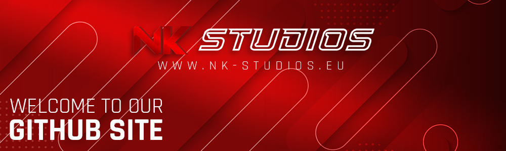

<!-- HEADER -->

  

<!-- MAIN INFORMATION -->

  <a href="#-products">NK Products</a> •
  <a href="https://www.nk-studios.eu">Website</a> 
  
  

 

<!-- DESCRIPTION -->
# 》 NK STUDIOS - Developer Studio with ❤
NK Studios is a German development studio that develops and publishes free, partly open-source, and partly paid products. Whether it's comprehensive PHP web tools, websites, FiveM or Minecraft scripts, and much more.
We want to offer professional tools and scripts, coded with passion, for free or at affordable prices, and turn our ideas into high-quality products.

<!-- DESCRIPTION -->
# 》 Products
> [!IMPORTANT]
> The product list coming soon. Stay tuned for the upcoming products.
